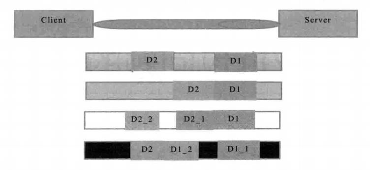
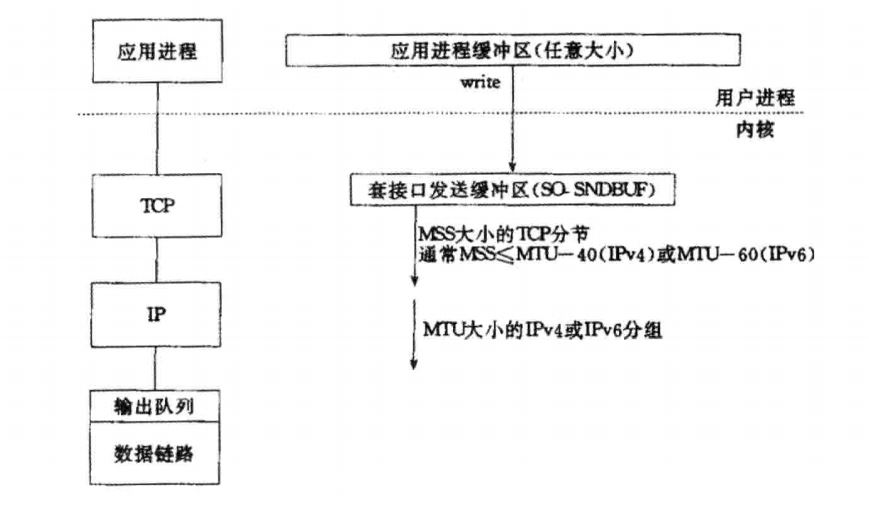
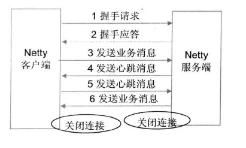
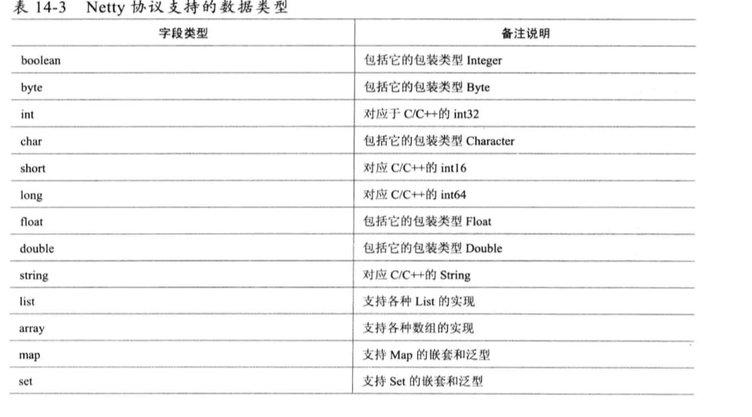
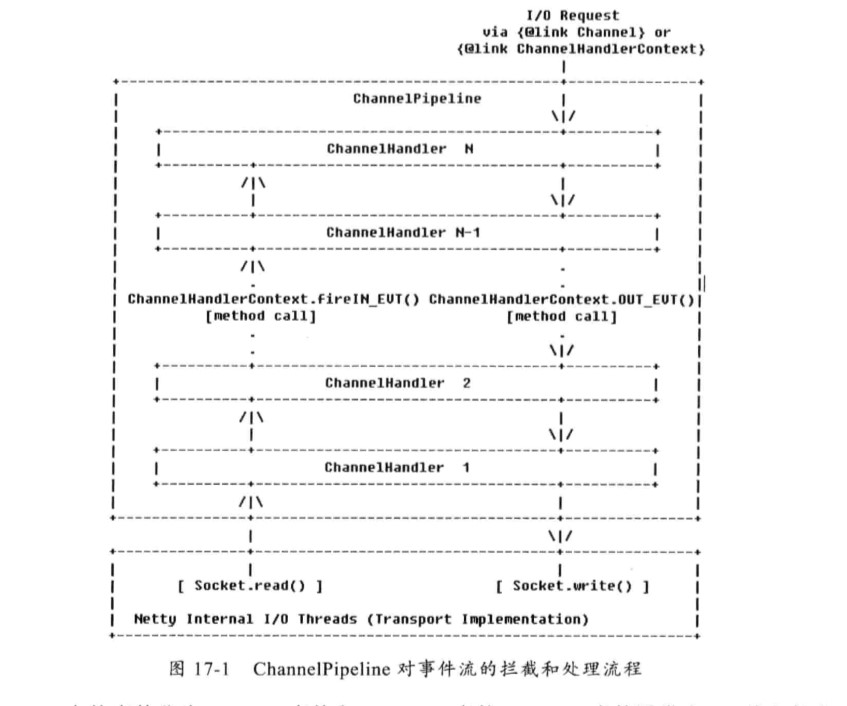
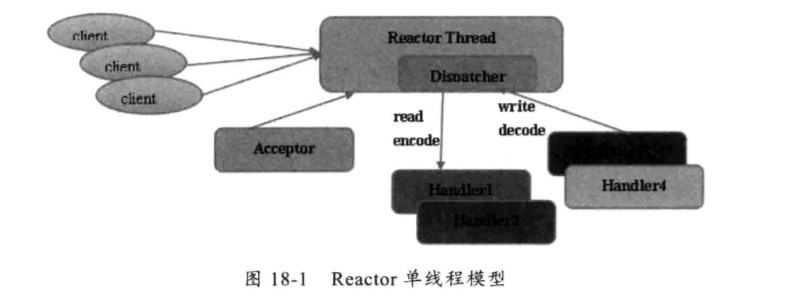
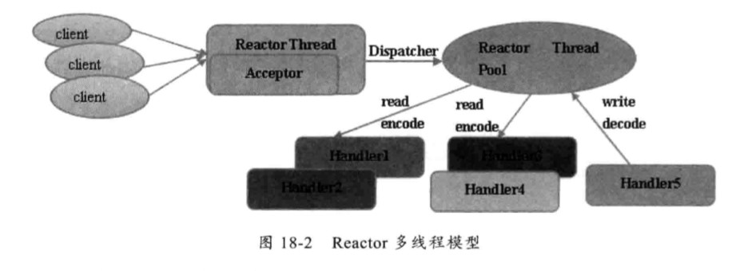
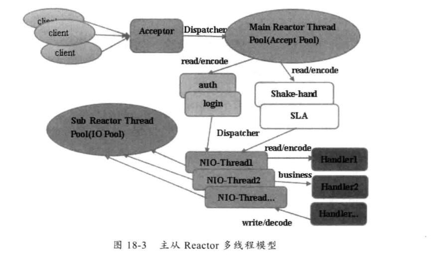
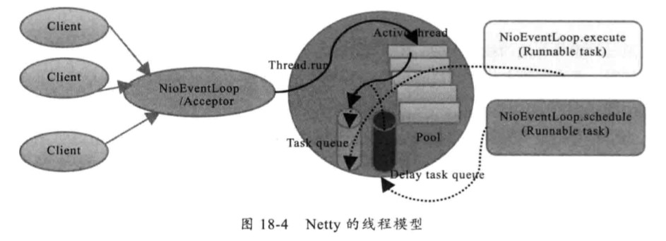
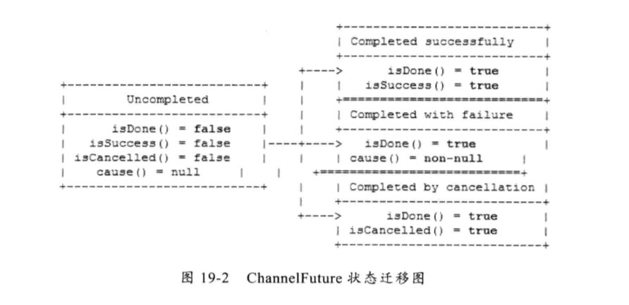

Netty权威指南/李林峰著   2014.6版

# 第 1 章 Java的I/O演进之路

## 1.1 I/O基础入门

### 1.1.1 Linux网络I/模型简介
  Linux的内核将所有外部设备都看做一个文件夹操作，对一个文件的读写操作会调用内核提供的系统命令，返回一个file descriptor（fd：文件描述符）。而对一个socket的读写也会有相应的描述符，成为socketfd（socket描述符），描述符就是一个数字，它指向内核中的一个结构体（文件路径，数据区等一些属性）。
  根据UNIX网络编程对I/O模型的分析，UNIX提供了5中I/O模块,分别如下：
  （1）阻塞I/O模型：
  （2）非阻塞I/O模型：
  （3）I/O复用模型：
  （4）信号驱动I/O模型：
  （5）异步I/O：

### 1.1.2 I/O多路复用技术
  epoll与select的原理比较类似，为了克服select的缺点，epoll作了很多重大改进：
  1. 支持一个进行打开的socket描述符（FD）不受限制（仅受限于操作系统的最大文件句柄数）
  2. I/O效率不会随着FD数目的增加而线性下降
  3. 使用mmap加速内核与用户空间的消息传递
  4. epoll的API更加简单

# 第 2 章 NIO入门

## 2.1 传统的BIO编程
## 2.2 伪异步I/O编程

## 2.3 NIO编程

### 2.3.1 NIO类库简介

  1. 缓冲区Buffer
  2. 通道Channel
  Channel是一个通道，可以通过它读取和写入数据，它就像自来水管一样，网络数据通过Channel读取和写入。通道与流的不同之处在于通道是双向的，流只是在一个方向上移动（一个流必须是InputStream或者OutputStrem的子类），而且通道可以用于读、写或者同事用于读写。
  3. 多路复用器Selector
  多路复用器提供选择已经就绪的任务的能力。简单来讲，Selector会不断地轮询注册在其上的Channel，会被Selector轮询出来，然后通过SelectionKey可以获取就绪Channel的集合，进行后续的I/O操作.

### 2.3.2 NIO服务端序列图

  源码示例 P29


### 2.3.4 NIO客户端序列图
  P36

使用NIO编程的有点总结：
（1） 客户端发起的连接操作是异步的，可以通过在多路复用器注册OP_CONNECT等待后续结果，不需要像之前的客户端那样被同步阻塞；
（2） SocketChannel的读写操作都是异步的，如果没有可读写的数据它不会同步等待，直接返回，这样的I/O通信线程就可以处理其他的链路，不需要同步等待这个链路可用；
（3） 线程模型的优化：由于JDK的Selector在Linux等主流操作系统上通过epoll实现，它没有连接句柄数的限制（只受限于操作系统的最大句柄数或者对单个进程的句柄限制），这意味着一个Selector线程可以同时处理成千上万个客户端连接，而且性能不会随着客户端的增加而线程下降，因此，它非常适合做高性能、高负载的网络服务器。

## 2.4 AIO编程
  NIO2.0引入了新的异步通道的概念，并提供了异步文件通道和异步套接字通道的实现。异步通道提供两种方式获取操作结果：
    通过java.util.concurrent.Future类来表示异步操作的结果；
    在执行异步操作的时候引入一个java.nio.channels
  CompletionHandler接口的实现类作为操作完成的回调。

  NIO2.0的异步套接字通道是真正的异步非阻塞I/O，它对应UNIX网络编程中的事件驱动I/O(AIO)，它不需要通过多路复用器（Selector）对注册的通道进行轮询操作即可实现异步读写，从而简化了NIO的编程模型。

## 2.5 4中I/O的对比
 P58

半包消息的问题？？？

# 第 3 章 Netty入门应用

# 第 4 章 TCP粘包/拆包问题的解决之道

## 4.1 TCP粘包/拆包

### 4.1.1 TCP粘包/拆包问题说明
\
  假设客户端分别发送了两个数据包D1和D2给服务端，由于服务端一次读取到的字节数是不确定的，故可能存在以下4种情况。
  （1）服务端分两次读取到了两个独立的数据包，分别是D1和D2，没有粘包和拆包；
  （2）服务端一次接收到了两个数据包，D1和D2粘合在一起，被称为TCP粘包；
  （3）服务端分两次读取到了两个数据包，第一次读取到了完整的D1包和D2包的部分内容，第二次读取到了D1包的剩余内容，被称为TCP拆包；
  （4）服务端分两次读取到了两个数据包，第一次读取到了D1包的部分内容D1_1,第二次读取到了D1包的剩余内容D1_2和D2包的整包，期间发生了多次的拆包。

### 4.1.2 TCP粘包/拆包产生原因
    问题产生的原因有三个，分别如下：
    （1） 应用程序write写入的字节大小大于套接口发送缓冲区大小；
    （2） 进行MSS大小的TCP分段；
    （3） 以太网帧的payload打于MTU进行IP分片。图解如图所示：\
  \
  MTU: Maxitum Transmission Unit 最大传输单元 \
  MSS: Maxitum Segment Size 最大分段大小

### 4.1.3 粘包问题的解决策略
  由于底层的TCP无法理解上层的业务数据，所以在底层是无法保证数据包不被拆分和重组的，这个问题只能通过上层的应用协议栈设计来解决，根据业界的主流协议的解决方案，可以归纳如下：
  （1） 消息定长，例如每个报文的大小为固定长度200字节，如果不够，空位补空格；
  （2） 在包尾增加回车换行符进行分割，例如FTP协议；
  （3） 将消息分为消息头和消息体，消息头中包含表示消息总长度（或者消息体长度）的字段，通常设计思路为消息头的第一个字段使用int32来表示消息的总长度；
  （4） 更复杂的应用层协议。

## 4.2 
## 4.3 利用LineBasedFrameDecoder解决TCP粘包问题

### 4.3.4 LineBasedFrameDecoder和StringDecoder的原理分析
  LineBasedFrameDecoder的工作原理是它依次遍历ByteBuf中的可读字节，判断看是否有“\n”或者“\r\n”,如果有,就以此位置为结束位置，从可读索引到结束位置区间的字节就组成了一行。它是以换行符为结束标志的解码器，支持携带结束符或者不携带结束符两种解码方式，同时支持配置单行的最大长度。如果连续读取到最大长度后仍然没有发现换行符，就会抛出异常，同时忽略掉之前读取到的异常码流。

  StringDecoder就是将接收到的对象转换成字符串，然后继续调用后面的handler，StringDecoder和LineBasedFrameDecoder的的组合就是按行切换的文本解码器，它被设计用来支持TCP的粘包和拆包。

  Netty提供了多种支持TCP粘包和拆包的解码器，用来满足用户不同的诉求。详细方式在第五章解读

# 第 5 章 分隔符和定长解码器的应用
DelimiterBasedFrameDecoder：可以自动完成对分隔符做结束标记的消息的解码
FixedLengthFrameDecoder:可以自动完成对定长消息的解码


中级篇
Netty 编解码开发指南

# 第 6 章 编解码技术
  当进行远程跨进程服务调用时，需要把被传输的Java对象编码为字节数组或者ByteBuffer对象。而当远程服务读取到ByteBuffer对象或者字节数组时，需要将其解码为发送时的Java对象。这被称为Java对象编解码技术。

## 6.1 Java序列化的缺点

### 6.1.1 无法跨语言
### 6.1.2 序列化后的码流太大
  判断一个编解码框架的优劣时，考虑以下几个因素：
  - 是否支持跨语言，支持的语言种类是否丰富；
  - 编码后的码流大小；
  - 编解码的性能；
  - 类库是否小巧，API适用是否方便；
  - 使用者需要手工开发的工作量和难度。

### 6.1.3 序列化性能太低

## 6.2 业界主流的编解码框架

### 6.2.1 Google的Protobuf介绍

# 第 7 章 Java序列化

# 第 8 章 Google Protobuf编解码
## 8.3 Protobuf的使用注意事项
ProtobufDecoder仅仅负责解码，它不支持读半包。因此，在ProtobufDecoder前面，一定要有能够处理半包的解码器，有三种方式可以选择：
  - 使用Netty提供的ProtobufVarint32FrameDecoder，它可以处理半包消息；
  - 继承Netty提供的通用半包解码器LengthFieldBasedFrameDecoder；
  - 继承ByteToMessageDecoder类，自己处理半包消息。

高级篇
Netty 多协议开发和应用

# 第 10 章 HTTP协议开发应用
todo

# 第 11 章
# 第 12 章
# 第 13 章

# 第 14 章 私有协议栈开发

## 14.2 Netty协议栈功能设计
  Netty协议栈用于内部各模块之间的通信，它基于TCP/IP协议栈，是一个类HTTP协议栈的应用层协议栈，相比于传统的标准协议栈，它更加轻巧、灵活和使用。

### 14.2.1 网络拓扑图
  在分布式组网环境下，每个Netty节点（Netty进程）之间建立长连接，使用Netty协议进行通信。Netty节点并没有服务端和客户端的区分，谁首先发起连接，谁就作为客户端，另一方自然就成为服务端。一个Netty节点既可以作为客户端连接另外的Netty节点，也可以作为Netty服务端被其他Netty节点连接，这完全取决于使用者的业务场景和具体的业务组网。如下图所示：
  \

### 14.2.2 协议栈功能描述
Netty协议栈承载了业务内部各模块之间的消息交互和服务调用，它的主要功能如下：
（1） 基于Netty的NIO通信框架，提高高性能的异步通信能力；
（2） 提供消息的编解码框架，可以实现POJO的序列化和反序列化；
（3） 提供基于IP地址的白名单接入认证机制；
（4） 链路的有效性校验机制；
（5） 链路的断连重连机制。

### 14.2.3 通信模型
如下图所示：\
\

具体步骤：
1. Netty协议栈客户端发送握手请求信息，携带节点ID等有效身份认证信息；
2. Netty协议服务端对握手请求消息进行合法性校验，包括节点ID有效性校验、节点重复登录校验和IP地址合法性校验，校验通过后，返回登录成功的握手应答消息；
3. 链路建立成功之后，客户端发送业务消息；
4. 链路成功之后，服务端发送心跳消息；
5. 链路建立成功之后，客户端发送心跳消息；
6. 链路建立成功之后，服务端发送业务消息；
7. 服务端退出时，服务端关闭连接，客户端感知对方关闭连接后，被动关闭客户端连接。

备注：需要指出的是，Netty协议通信双方链路建立成功之后，双方可以进行**全双工通信**，无论客户端还是服务器端，都可以主动发送请求消息给对方，通信方式可以是TWO WAY或者ONE WAY。双方之间的心跳采用Ping-Pong机制，当链路处于空闲状态时，客户端主动发送Ping消息给服务端，服务端接收到Ping消息后发送应答消息Pong给客户端，如果客户端连续发送N条Ping消息都没有接收到服务端返回的Pong消息，说明链路已经挂死或者对方出入异常状态，客户端主动关闭连接，间隔周期T后发起重连操作，知道重连成功。

### 14.2.4 消息定义---P.255
Netty协议栈消息定义包含两部分:
- 消息头
- 消息体

### 14.2.5 Netty协议支持的字段类型\

### 14.2.6 Netty协议的编解码规范---P.257
1. Netty协议的编码；
2. Netty协议的解码

### 14.2.7 链路的建立

### 14.2.8 链路的关闭

### 14.2.9 可靠性设计
1. 心跳机制
2. 重连机制
3. 重复登录保护
4. 消息缓存重发

### 14.2.10 安全性设计

### 14.2.11 可扩展性设计


## 14.3 Netty协议栈开发---重点章节(P.263)

### 14.3.1 数据结构定义
1. 定义Netty协议栈使用的数据结构---NettyMessage类定义
2. 消息头Header类定义

由于心跳消息、握手消息和握手应答消息都可以统一由NettyMessage承载，所以不需要为这几类控制消息做单独的数据结构定义。

### 14.3.2 消息编解码
分别定义NettyMessageDecoder和NettyMessageEncoder用于NettyMessage消息的编解码。

### 14.3.3 握手和安全认证
握手的发起是在**客户端**和服务端TCP链路建立成功通道激活时，握手消息的接入和安全认证在**服务端处理**。

### 14.3.4 心跳检测机制
握手成功之后，由客户端主动发松心跳消息，服务端接收到心跳消息之后，返回心跳应答消息。由于心跳消息的目的是为了检测链路的可用性，因此不需要携带消息体。


源码分析

# 第15章 ByteBuf和相关辅助类
## 15.1 ByteBuf功能说明
当我们进行数据传输的时候，往往需要使用到缓冲区，常用的缓冲区就是JDK NIO类库提供的Java.nio.Buffer。但是ByteBuffer有一些不足：

为了弥补这些不足，Netty提供了自己的ByteBuffer实现---ByteBuf。
## 15.1.1 ByteBuf的工作原理
JDK ByteBuffer由于只有一个位置指针用于处理读写操作，因此每次读写的时候都需要额外调用flip()和clear()等方法，否则功能将出错。

ByteBuf 通过两个位置指针来协助缓冲区的读写操作，读操作使用readerIndex,写操作使用writerIndex。
由于写操作不修改readerIndex指针，读操作不修改writerIndex指针，因此不再需要调整位置指针，这极大地简化了缓冲区的读写操作，避免了由于遗漏或者不熟悉flip()操作导致的功能异常。

## 15.1.2 ByteBuf的功能介绍

1. 顺序读操作（read）
2. 顺序写操作（write）
3. readerIndex和wirterIndex
   Netty提供了两个指针变量用于支持顺序读取和写入操作：readerIndex用于标识读取索引，writerIndex用于标识写入索引。两个位置指针将ByteBuf缓冲区分割成三个区域。如图所示：\
   
   调用ByteBuf的read操作时，从readerIndex处开始读取。readereIndex到writerIndex之间的空间为可读的字节缓冲区；从writerIndex到capacity之间为可写的字节缓冲区；0到readerIndex之间是已经读取过的缓冲区，可以调用discardReadBytes操作来宠用这部分空间，以节约内存，防止ByteBuf的动态扩张。

4. Discardable bytes
ByteBuf的discardReadBytes操作效果如下：
操作之前：\


操作之后: \


需要指出的是，调用discardReadBytes会发生字节数组的内存复制，所以，频繁调用将会导致性能下降，因此在调用它之前，要确认你确实需要这样做，例如牺牲性能来换取更多的可用内存。

需要指出的是，调用discardReadBytes操作之后的writable bytes内容处理策略跟ByteBuf接口的具体实现有关。
5. Readable bytes和Writable bytes
   可读空间是数据实际存储的区域，以read或者skip开头的任何操作将会从readerIndex开始读取或者跳过指定的数据，操作完成之后readerIndex增加了读取或者跳过的字节数长度。
   可写空间段是尚未被使用可以填充的空闲空间，任何以write开头的操作都会从writerIndex开始向空闲空间写入字节，操作完成之后writerIndex增加了写入的字节数长度。
6. clear操作

正如JDK ByteBuffer的clear操作,它并不会清空缓冲区内容本身，例如填充为NULL(0x00).它主要用来操作位置指针。
7. Mark和Rest
  对于JDK的ByteBuffer，调用mark操作会将当前的位置指针备份到mark变量中，当调用rest操作之后，重新将指针的当前位置恢复为备份在mark中的值。
  
  Netty的ByteBuf也有类似的rest和mark接口，因为ByteBuf有读索引和写索引，因此，它总共有4个相关方法：
markReaderIndex：将当前的readerIndex备份到markedReaderIndex中；
restReaderIndex：将当前的readerIndex设置为markedReaderIndex中；
markWriterIndex：将当前的writerIndex备份到markedWriterIndex中；
restReaderIndex：将当前的writerIndex设置为markedWriterIndex中；

8. 查找操作
   ByteBuf提供了多种查找方法：P307
9.  Derived buffers
    类似于数据库的试图，ByteBuf提供了多个接口用于创建某个ByteBuf的视图或者复制ByteBuf；P308
10. 转换成标准的ByteBuffer
    当通过NIO的SocketChannel进行网络读写时，操作的对象是JDK标准的java.nio.ByteBuffer,由于Netty统一使用ByteBuf替代JDK原生的java.nio.ByteBuffer，索引必须从接口层面支持两者的相互转换。
    将ByteBuf转换成java.nio.ByteBuffer的方法有两个：
    (1) ByteBuffer nioBuffer():将当前ByteBuf可读的缓冲区转换成ByteBuffer，两者共享同一个缓冲区内容引用，对ByteBuffer的读写操作并不会修改原ByteBuf的读写索引。需要指出的是，返回后的ByteBuffer无法感知原ButeBuf的动态扩容操作。
    (2) ByteBuffer nioBuffer(int index,int length)
11. 随机读写
    ByteBuf随机写操作不支持动态扩展缓冲区

## 15.2 ByteBuf源码分析
### 15.2.1 ByteBuf的主要类继承关系

从内存分配角度看，ByteBuf可以分为两类：
（1） 堆内存（HeapByteBuf）字节缓冲区
（2） 直接内存（DirectByteBuf）字节缓冲区：
经验表明，ByteBuf的最佳实践是在I/O通信线程的读写缓冲区使用DirectByteBuf，后端业务消息的编解码模块使用HeapByteBuf，这样组合可以达到性能最优。

### 15.2.2 AbstractByteBuf源码分析


3. 写操作簇
>> Netty的ByteBuffer可以动态扩展，为了保证安全性，允许使用者指定最大的容量，在容量范围内，可以先分配个较小的初始容量，后面不够再用动态扩展，这样可以达到功能和性能的最优组合。

P316

扩展采用先倍增后步进的原因 ：当内存较小的情况下，倍增操作并不会带来太多的内存浪费，例如64字节-->128字节-->256字节，这样的内存扩张方式对于大多数应用系统是可以接受的。但是，当内存增长到一定阈值后，再进行倍增就可能会带来额外的内存浪费，例如10M，采用倍增后变为20M，很有可能系统只需要12M，扩张到20M后会带来8M的内存浪费。

5. 重用缓冲区-disCardReadBytes

### 15.2.3 AbstractReferenceCountedByteBuf源码分析
### 15.2.4 UnpooledHeapByteBuf源码分析
  UnpooledHeapByteBuf是基于堆内存进行内存分配的字节缓冲区，它没有基于对象池技术实现，这就意味着每次I/O的读写都会创建一个新的UnpooledHeapByteBuf，频繁的进行大块内存的分配和回收对性能会造成一定影响，但是相比对外内存的申请和释放，它的成本还是会低一些。
### 15.2.5 PooledByteBuf内存池原理分析
1. PoolArena
2. PoolChunk
   Chunk主要用来组织和管理多个Page的内存分配和释放。在Netty中，Chunk中的Page被构建成一颗二叉树。（对树的遍历采用深度优先的算法）
3. PoolSubPage
4. 内存回收策略
   无论是Chunkh还是Page，都通过状态位来标识内存是否可用，不同之处是Chunk通过在二叉树上对节点进行标识实现，Page是通过维护块的使用状态标识来实现。

### 15.2.6 PooledDirectByteBuf源码分析
  PooledDirectByteBuf基于内存池实现，与UnPooledDirectByteBuf的唯一不同就是缓冲区的分配是销毁策略不同，其他功能都是等同的，也就是说，**两者唯一的不同就是内存分配策略不同。**

## 15.3 ByteBuf相关的辅助类功能介绍
### 15.3.4 ByteBufUitl
  ByteBufUitl是一个非常有用的工具类，它提供了一系列静态方法 用于操作ByteBuf对象。

# 第16章 Channel和Unsafe
## 16.1 Channel 功能说明
  io.netty.channel.Channel是Netty网络操作抽象类，它聚合了一组功能，包括但不限于网络的读、写，客户端发起连接、主动关闭连接，链路关闭，获取通信双方的网络地址等。

### 16.1.1 Channel的工作原理
Channel是Netty抽象出来的网络I/O读写相关的接口，为什么不使用JDK NIO原生的Channel而另起炉灶的原因：
（1） JDK的SocketChannel和ServerSocketChannel没有统一的Channel接口供业务开发者使用，对于用户而言，没有统一的操作视图，使用起来不方便；
（2） JDK的SocketChannel和ServerSocketChannel的主要职责就是网络I/O操作，由于它们是SPI类接口，由具体的虚拟机厂家来提供，所以通过继承SPI功能类来扩展其功能的难度很大；直接实现ServerSocketChannel和SocketChannel抽象类，其工作量和重新开发一个新的Channel功能类差不多；
（3） Netty的Channel需要能够跟Netty的整体架构融合在一起，例如I/O模块、基于ChannelPipline的定制模块，以及基于元数据描述配置化的TCP参数等；
（4）自定义的Channel，功能实现更加灵活。

Netty的Channel设计理念：
（1）在Channel接口层，采用Facade模式进行统一封装，将网络I/O操作、网络I/O相关联的其它操作封装起来，统一对外提供；
（2） Channel接口的定义尽量大而全，为SocketChannel和ServerSocketChannel提供统一的视图，由不同子类实现不同的功能，公共功能在抽象父类中实现，最大程度上实现功能和接口的重用；
（3） 具体实现采用聚合而非包含的方式，将相关的功能类聚合在Channel中，由Channel统一负责分配和调度，功能实现更加灵活。


### 16.1.2 Channel的功能介绍
P342
1. 网络I/O操作

2. 其它常用的API功能说明

## 16.2 Channel源码分析
选择最重要的两个Channel-io.netty.channel.socket.nio.NioServerSocketChannel和io.netty.channel.socket.nio.NioSocketChannel进行重点分析。
### 16.2.1 Channel的主要继承关系类图
### 16.2.2 AbstractChannel源码分析
### 16.2.3 AbstractNioChannel源码分析
### 16.2.4 AbstractNioByteChannel源码分析
### 16.2.4 AbstractNioMessageChannel源码分析
### 16.2.5 AbstractNioMessageServerChannel源码分析
### 16.2.7 NioServerSocketChannel源码分析
### 16.2.8 NioSocketChannel源码分析
P360
1. 连接操作

2. 写半包
P363
3. 读写操作

## 16.3 Unsave功能说明
  Unsafe接口实际上是Channel接口的辅助接口，它不应该被用户代码直接调用。实际的I/O读写操作都是由Unsafe接口负责完成的。

## 16.4 Unsafe源码分析

### 16.4.2 AbstractUnsafe源码分析
P367
1.  register方法
2.  bind方法
3.  disconnect方法
4.  close方法
5.  write方法
  write方法实际上将消息添加到环形发送数组中，并不是真正的写Channel。
6.  flush方法
  flush方法负责将发送缓冲区中待发送的消息全部写到Channel中，并发送给通信方。

### 16.4.3 AbstractNioUnsafe源码分析
AbstractNioUnsafe是AbstractUnsafe类的NIO实现，它主要实现了connect、finishConnect等方法。

### 16.4.4 NioByteUnsafe源码分析
  重点关注read方法；

  AdaptiveRecvByteBufAllocator值的是缓冲区大小可以动态调整的ByteBuf分配器。内部类HandleImpl---record(),实现了动态扩容的逻辑。

# 第17章 ChannelPipeline和ChannelHandler
Netty的ChannelPipeline和ChannelHandler机制类似于Servlet和Filter过滤器，这类拦截器实际上是职责链模式的一种变形，主要是为了方便事件的拦截和用户业务逻辑的定制。

## 17.1 ChannelPipeline功能说明
ChannelPipeline是ChannelHandler的容器，它负责ChannelHandler的管理和事件拦截与调度。

### 17.1.1 ChannelPipeline的事件处理

Netty 中的事件分为inbound事件和outbound事件。
inbound事件通常由I/O线程触发，例如TCP链路建立事件、链路关闭事件、读事件、异常通知事件等。它对应图17-1的左半部分。


Outbound事件通常是由用户主动发起的网络I/O操作，例如用户发起的连接操作、绑定操作、消息发送等操作。

### 17.1.2 自定义拦截器
通常ChannelHandler只需要继承ChannelHandlerAdapter类覆盖自己关系的方法即可。

### 17.1.3 构建pipeline
事实上用户不需要自己创建pipeline，因为使用ServerBootstrap和Bootstrap启动服务端或者客户端时，Netty会为每个Channel连接创建一个独立的pipline。对于使用者而言，只需要将自定义的拦截器加入到pipeline中即可。

  对于类似于编解码这样的ChannelHandler，它存在先后顺序，例如MessageToMessageDecoder，在它之前往往需要有ByteToMessageDecoder将ByteBuf解码为对象，然后对对象做二次解码得到最终的POJO对象。

### 17.1.4 ChannelPipeline的主要特性
ChannelPipeline支持运行态动态的添加或者删除ChannelHandler，例如在业务高峰期需要对系统做拥塞保护时。
ChannelPipeline是线程安全的，但是ChannelHandler却不是线程安全的。

## 17.2 ChannelPipeline源码分析
  ChannelPipeline的代码相对比较简单，它实际上是一个ChannelHandler的容器，内部维护了一个ChannelHandler的链表和迭代器。

### 17.2.3 ChannelPipeline的inbound事件
  由于网络I/O相关的事件有限，因此Netty对这些事件进行了统一抽象，Netty自身和用户的ChannelHandler会对感兴趣的事件进行拦截和处理。

  **pipeline中以fireXXX命名的方法都是从IO线程流向用户业务Handler的inbound事件**。

### 17.2.4 ChannelPipeline的outbound事件
  由用户线程或者代码发起的I/O操作被称为outbound事件。
  
  Pipeline本身并不直接进行I/O操作，在前面对Channel和Unsafe的介绍中我们指定最终都是由Unsafe和Channel来实现真正的I/O操作的。Pipeline负责将I/O事件通过TailHandler进行调度和传播，最终调用Unsafe的I/O方法进行I/O操作。

## 17.3 ChannelHandler功能说明
  ChannelHandler类似于Servlet的Filter过滤器，负责对I/O事件或者I/O操作进行拦截和处理，它可以选择性地拦截和处理自己感兴趣的事件，也可以透传和终止事件的传递。

### 17.3.1 ChannelHandlerAdapter功能说明

### 17.3.3 MessageToMessageDecoder功能说明
  MessageToMessageDecoder实际上是Netty的二次解码器，它的职责是将一个对象二次解码为其它对象。

### 17.3.3 LengthFieldBasedFrameDecoder功能说明
  前面介绍了Netty提供的半包解码器LineBasedFrameDecoder和DelimiterBasedFrameDecoder，最通用的半包解码器---LengthFieldBasedFrameDecoder：

  如何区分一个整包消息，通常有如下4种做法：
  - 固定长度；
  - 通过回车换行符区分消息；
  - 通过分隔符区分整包消息；
  - 通过指定长度来标识整包消息。
  如果消息是通过长度进行区分的，LengthFieldBasedFrameDecoder都可以自动处理粘包和半包问题，只需要传入正确的参数，即可轻松搞定"读半包"问题。
P402
  
  由于TCP存在粘包和组包问题，所以**通常情况下必须自己处理半包消息**。利用LengthFieldBasedFrameDecoder解码器可以**自动解决半包问题**，通常做法如下：
  ```
  pipeline.addLast("frameDecoder",new LengthFieldBasedFrameDecoder(1024,0,4));
  ```
### 17.3.5 MessageToByteEncoder功能说明
  MessageToByteEncoder负责将POJO对象解码成ByteBuf。

### 17.3.5 MessageToMessageEncoder功能说明
  将一个POJO对象编码成另一个对象。

## 17.4 ChannelHandler源码分析
### 17.4.1 ChannelHandler的类继承关系图

  由于ChannelHandler是Netty框架和用户代码的主要扩展和定制点，所以它子类种类繁多、功能各异，系统ChannelHandler主要分类如下：
  - ChannelPipeline的系统ChannelHandler，用于I/O操作和对事件进行预处理，对于用户不可见，这类ChannelHandler主要包括HeadHandler和TailHandler；
  - 编解码ChannelHandler，包括ByteToMessageCodec,MessageToMessageDecoder等；
  - 其它系统功能性ChannelHandler，包括流量整形Handler，读写超时Handler，日志Handler等；

### 17.4.2 ByteToMessageDecoder源码分析
P408
### 17.4.3 MessageToMessageDecoder源码分析
### 17.4.4 LengthFieldBasedFrameDecoder源码分析
P413
### 17.4.5 MessageToByteEncoder源码分析

### 17.4.7 LengthFieldPrepender源码分析
  LengthFieldPrepender负责在待发送的ByteBuf消息头中增加一个长度字段来标识消息的长度，它简化了用户的编码器开发，使用户不需要额外去设置这个长度字段。

# 第18章 EventLoop和EventLoopGroup
## 18.1 Netty的线程模型
### 18.1.1 Reactor单线程模型
  Reactor单线程模型，是指所有的I/O操作都在同一个NIO线程上面完成。NIO线程的职责如下：
  - 作为NIO服务端，接收客户端的TCP连接；
  - 作为NIO客户端，向服务端发起TCP连接；
  - 读取通信对端的请求或者应答消息；
  - 向通信对端发送消息请求或者应答消息。
  
  Reactor单线程模型如图所示：
\

  由于Reactor模式使用的是异步非阻塞I/O,所有的I/O操作都不会导致阻塞，理论上一个线程可以独立处理都有I/O相关的操作。从架构层面看，一个NIO线程确实可以完成其承担的职责。

### 18.1.2 Reactor多线程模型
  Reactor多线程模型与单线程模型最大的区别就是有一组NIO线程来处理I/O操作，如图：
  \
  Reactor多线程模型的特点如下：
  - 有专门一个NIO线程---Acceptor线程用于监听服务端，接收客户端的TCP连接请求；
  - 网络I/O操作---读、写等由一个NIO线程池负责，线程池可以采用标准的JDK线程池实现，它包含一个任务队列和N个可用的线程，由这些NIO线程负责消息的读取、编码、解码和发送。
  - 一个NIO线程可以同时处理N条链路，但是一个链路只对应一个NIO线程，防止发生并发操作问题。

### 18.1.3 主从Reactor多线程模型
  主从Reactor多线程模型的特点是：服务端用于接收客户端连接的不再是一个单独的NIO线程，而是一个独立的NIO线程池。Acceptor接收到客户端TCP连接请求并处理完成后（可能包含接入认证等），将新创建的SocketChannel注册到I/O线程池（sub reactor线程池）的某个I/O线程上，由它负责SocketChannel的读写和编解码工作。Acceptor线程池仅仅用户客户端的登录、握手和安全认证，一旦链路建立成功，就将链路注册到后端subReactor线程池的I/O线程上，由I/O线程负责后续的I/O操作。如图：
  

### 18.1.4 Netty的线程模型
  Netty的线程模型并不是一成不变的，它实际取决于用户的启动参数配置。通过设置不同的启动参数，Netty可以同时支持Reactor单线程模型、多线程模型和主从Reactor多线程模型。Netty的线程模型如图：
  \
  服务端启动的时候，创建了两个NioEventLoopGroup，它们实际是两个独立的Reactor线程池。一个用于接收客户端的TCP连接，另一个用于处理I/O相关的读写操作，或者执行系统Task、定时任务Task等。

### 18.1.5 最佳实践
  Netty的多线程编程最佳实践如下：
  1. 创建两个NioEventLoopGroup，用于逻辑隔离NIO Acceptor和NIO I/O线程；
  2. 尽量不要再ChannelHandler中启动用户线程（解码后用于将POJO消息派发到后端业务线程的除外）；
  3. 解码要放在NIO线程调用的解码Handler中进行，不要切换到用户线程中完成消息的解码；
  4. 如果业务逻辑操作非常简单， 没有复杂的业务逻辑计算，没有可能会导致线程被阻塞的磁盘操作、数据库操作、网络操作等，可以直接再NIO线程上完成业务逻辑编排，不需要切换到用户线程；
  5. 如果业务线程处理复杂，不要在NIO线程上完成，建议将解码后的POJO消息封装成Task，派发到业务线程池中由业务线程执行，以保证NIO线程尽快被释放，处理其他的I/O操作。
   
  推荐的线程数量计算公式有以下两种：
  - 公式一：线程数量=（线程总时间/瓶颈资源时间）*瓶颈资源的线程并行数；
  - 公式二：QPS=10000/线程总时间*线程数。

## 18.2 NioEventLoop源码分析
### 18.2.1 NioEventLoop设计原理
  Netyy的NioEventLoop并不是一个纯粹的I/O线程，它除了负责I/O的读写之前，还兼顾处理以下两类任务：
  - 系统Task；
  - 定时任务：

### 18.2.2 NioEventLoop继承关系类图
### 18.2.3 NioEventLoop源码
P429

tip :
1. Selector会触发JDK的epoll bug，通过计数空轮询count来判断是否重建rebuildSelector解决；
2. NioEventLoop线程池处理I/O时间和非I/O任务的队列维护P437

# 第19章 Future和Promise
## 19.1 Future功能
  Future最早来源怒JDK的java.util.concurrent.Future。

- ChannelFuture功能
  由于Netty的Future都是与异步I/O操作相关的，因此，命名为ChannelFuture，代表它与Channel操作相关。
  
  ChannelFuture有两种状态：uncompleted和completed；ChannelFuture的状态迁移图如图：
  \
  
  Netty强烈建议直接通过添加监听器的方式获取I/O操作结果，或者进行后续的相关操作。推荐通过GenericFutureListener代替ChannelFuture的get等方法的原因是：当我们进行异步I/O操作时，完成的时间是无法预测的，如果不设置超时时间，它会导致调用线程长时间被阻塞，甚至挂死。而设置超时时间，时间又无法精确预测。利用异步通知机制回调GenericFutureListener是最佳的解决方案，他的性能最优。

  异步I/O操作有两类超时:一个是TCP层面的I/O超时，另一个是业务逻辑层面的操作超时。

## 19.2 ChannelFuture源码分析

## 19.3 Promise功能介绍
  **Promise是可写的Future，Future自身并没有写操作相关的接口，Netty通过Promise对Future进行扩展，用于设置I/O操作的结果。**

  Netty发起I/O操作的时候，会创建一个新的Promise对象，例如调用ChannelHandlerContext的write(Object object)方法时，会创建一个新的ChannelPromise,在I/O操纵发生异常或者完成时，设置Promise的结果。

## 19.4 Promise源码分析
### 19.4.1 Promise继承关系图

### 19.4.2 DefaultPromise
